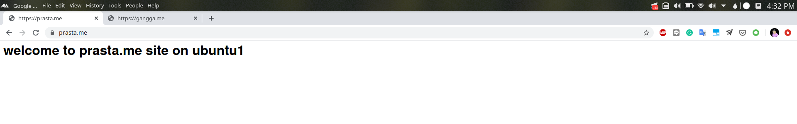
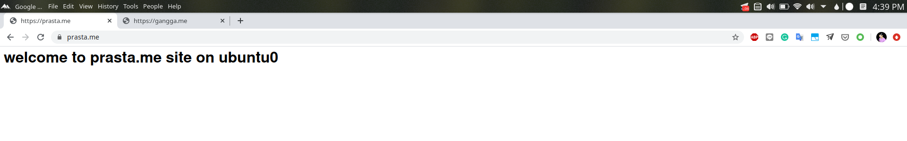
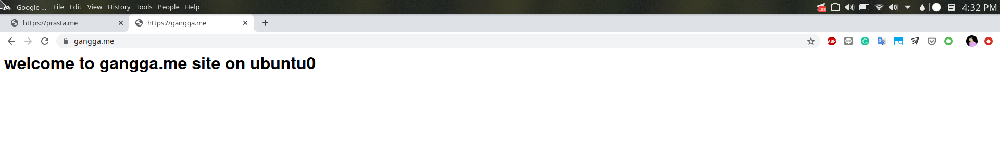

# Configure Octavia Loadbalancer for Using TLS Termination

This example is exactly like [TLS Termination](tls-termination.md), except that we have multiple TLS certificates that we would like to use on the same listener using Server Name Indication (SNI) technology.

## Certificate

### Create Certificate if Using Local Network (Optional)

- Follow this [step](https://dadhacks.org/2017/12/27/building-a-root-ca-and-an-intermediate-ca-using-openssl-and-debian-stretch/) for testing on local network (ENG)

- Follow this [step](https://medium.com/prastamaha/konfigurasi-root-ca-intermediate-ca-server-certificate-f7484dc2be24) for testing on local network (IND)

### __Certificate required__
Here exemplified the domain name that I use is prasta.me signed by intermediate CA btech

#### Server crt and key certificate

Domain: `gangga.me`

- gangga.me.crt.pem
- gangga.me.key.pem

Domain: `prasta.me`

- prasta.me.crt.pem
- prasta.me.key.pem

#### Intermediate CA

`gangga.me.crt.pem` and `prasta.me.crt.pem` signed by:
- int.btech.crt.pem

## Deploy Barbican

### Enable Barbican Service

Run on controller node using regular user (non-root)

```
nano /etc/kolla/globals.yml
```

Uncoment enable_barbican section
```
enable_barbican=yes
```

Deploy barbican
```
source ~/kolla-install/bin/activate
kolla-ansible deploy -t barbican
```
Install Barbican client command

```
pip install python-barbicanclient
```

## Configuration Step

### Instance
Previously there were 2 instances running nginx services on private-net

Each nginx has configured 2 virtual hosts / server blocks with server_name `prasta.me` and `gangga.me`

```
openstack server list

+--------------------------------------+---------+--------+-----------------------------+------------------------------+--------+
| ID                                   | Name    | Status | Networks                    | Image                        | Flavor |
+--------------------------------------+---------+--------+-----------------------------+------------------------------+--------+
| b122eafc-69eb-43ef-9391-9d5c28491b58 | ubuntu1 | ACTIVE | private-net=192.168.100.167 | bionic-server-cloudimg-amd64 | small  |
| ca385bc8-646c-42d0-b96b-038996ac068e | ubuntu0 | ACTIVE | private-net=192.168.100.81  | bionic-server-cloudimg-amd64 | small  |
+--------------------------------------+---------+--------+-----------------------------+------------------------------+--------+
```
how to configure nginx virtualhost? follow this [tutorial](https://www.digitalocean.com/community/tutorials/how-to-set-up-nginx-server-blocks-virtual-hosts-on-ubuntu-16-04)

### Combine individual server cert, key and intermediate ca to pcks12 format

`prasta.me`
```
openssl pkcs12 -export -inkey prasta.me.key.pem -in prasta.me.crt.pem -certfile int.btech.crt.pem -passout pass: -out prasta.me.p12

sudo chown $USER:$USER prasta.me.p12
```

`gangga.me`
```
openssl pkcs12 -export -inkey gangga.me.key.pem -in gangga.me.crt.pem -certfile int.btech.crt.pem -passout pass: -out gangga.me.p12

sudo chown $USER:$USER gangga.me.p12
```

### Store server.p12 to barbican

`prasta.me`
```
openstack secret store --name='tls_secret_prasta_me' -t 'application/octet-stream' -e 'base64' --payload="$(base64 < prasta.me.p12)"
```

`gangga.me`
```
openstack secret store --name='tls_secret_gangga_me' -t 'application/octet-stream' -e 'base64' --payload="$(base64 < gangga.me.p12)"
```

### Add acl for the created secret

if you log in as a tenant, change admin user to your user

```
secret_id1=$(openstack secret list | awk '/ tls_secret_prasta_me / {print $2}')
secret_id2=$(openstack secret list | awk '/ tls_secret_gangga_me / {print $2}')
```
```
openstack acl user add -u $(openstack user show admin -c id -f value) $secret_id1
openstack acl user add -u $(openstack user show admin -c id -f value) $secret_id2
```

### Create LoadBalancer on private-subnet

```
LB_VIP=$(openstack loadbalancer create --name lb1 --vip-subnet-id private-subnet | awk  '/ vip_address / {print $4}')
```

### Create floating ip and associate it to lb vip

Create floating ip
```
openstack floating ip create --floating-ip-address 10.20.110.50 public-net
```

associate floating ip to lb vip
```
openstack floating ip set --port $(openstack port list | grep $LB_VIP | cut -d '|' -f 3) 10.20.110.50
```
### Create Lisneter TLS TERMINATED using SNI

```
openstack loadbalancer listener create --protocol-port 443 --protocol TERMINATED_HTTPS --name https_listener --default-tls-container=$(openstack secret list | awk '/ tls_secret_prasta_me / {print $2}') --sni-container-refs $(openstack secret list | awk '/ tls_secret_prasta_me / {print $2}') $(openstack secret list | awk '/ tls_secret_gangga_me / {print $2}') -- lb1
```
__note__: if the connected web client does not support SNI, this configuration will direct lb to respond using `prasta.me` certificate

### Create Pool and assign instance become pool member

Create pool
```
openstack loadbalancer pool create --name pool1 --lb-algorithm ROUND_ROBIN --listener https_listener --protocol HTTP
```

Assign instance to pool
```
openstack loadbalancer member create --subnet-id private-subnet --address 192.168.100.167 --protocol-port 80 pool1
openstack loadbalancer member create --subnet-id private-subnet --address 192.168.100.81 --protocol-port 80 pool1
```

### Create Health Monitor
```
openstack loadbalancer healthmonitor create --delay 5 --max-retries 3 --timeout 5 --type HTTP --url-path / pool1
```

### Redirect http to https (optional)

create http listener
```
openstack loadbalancer listener create --name http_listener --protocol HTTP --protocol-port 80 lb1
```

create listener l7policy
```
openstack loadbalancer l7policy create --action REDIRECT_PREFIX --redirect-prefix https://prasta.me --name policy1 http_listener

openstack loadbalancer l7policy create --action REDIRECT_PREFIX --redirect-prefix https://gangga.me --name policy2 http_listener
```

create l7rule for l7policy
```
openstack loadbalancer l7rule create --compare-type STARTS_WITH --type HOST_NAME --value prasta.me policy1

openstack loadbalancer l7rule create --compare-type STARTS_WITH --type HOST_NAME --value gangga.me policy2
```

## Result

`prasta.me`




`gangga.me`


