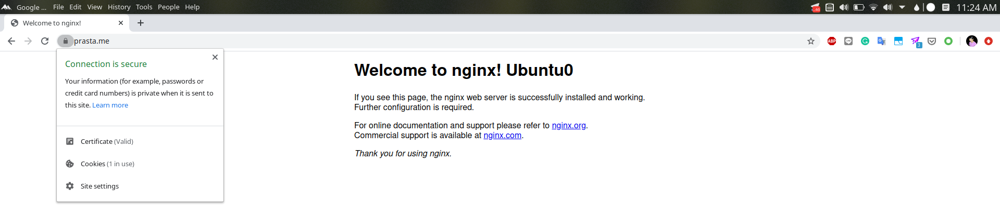

# Configure Octavia for Using TLS Termination

## Certificate

### Create Certificate if Using Local Network (Optional)

- Follow this [step](https://dadhacks.org/2017/12/27/building-a-root-ca-and-an-intermediate-ca-using-openssl-and-debian-stretch/) if testing on local network

### __Certificate required__
Here exemplified the domain name that I use is prasta.me signed by intermediate CA btech

Server crt and key certificate

- prasta.me.crt.pem
- prasta.me.key.pem

Intermediate CA

- int.btech.crt.pem

### Enable Barbican Service

Run on controller node using regular user (non-root)

```
nano /etc/kolla/globals.yml
```

Uncoment enable_barbican section
```
enable_barbican=yes
```

Deploy barbican
```
source ~/kolla-install/bin/activate
kolla-ansible deploy -t barbican
```
Install Barbican client command

```
pip install python-barbicanclient
```

### Instance
previously there were 2 instances running nginx services on private-net

```
openstack server list

+--------------------------------------+---------+--------+-----------------------------+------------------------------+--------+
| ID                                   | Name    | Status | Networks                    | Image                        | Flavor |
+--------------------------------------+---------+--------+-----------------------------+------------------------------+--------+
| b122eafc-69eb-43ef-9391-9d5c28491b58 | ubuntu1 | ACTIVE | private-net=192.168.100.167 | bionic-server-cloudimg-amd64 | small  |
| ca385bc8-646c-42d0-b96b-038996ac068e | ubuntu0 | ACTIVE | private-net=192.168.100.81  | bionic-server-cloudimg-amd64 | small  |
+--------------------------------------+---------+--------+-----------------------------+------------------------------+--------+
```

### Combine individual server cert, key and intermediate ca to pcks12 format

```
openssl pkcs12 -export -inkey prasta.me.key.pem -in prasta.me.crt.pem -certfile int.btech.crt.pem -passout pass: -out server.p12

sudo chown $USER:$USER server.p12
```


### Store server.p12 to barbican

```
openstack secret store --name='tls_secret_prasta_me' -t 'application/octet-stream' -e 'base64' --payload="$(base64 < server.p12)"
```
### Add acl for the created secret

if you log in as a tenant, change admin user to your user

```
secret_id=$(openstack secret list | awk '/ tls_secret1 / {print $2}')
openstack acl user add -u $(openstack user show admin -c id -f value) $secret_id
```


### Create LoadBalancer on private-subnet

```
LB_VIP=$(openstack loadbalancer create --name lb1 --vip-subnet-id private-subnet | awk  '/ vip_address / {print $4}')
```

### Create floating ip and assign it to lb vip

Create floating ip
```
openstack floating ip create --floating-ip-address 10.20.110.50 public-net
```

assign floating ip to lb vip
```
openstack floating ip set --port $(openstack port list | grep $LB_VIP | cut -d '|' -f 3) 10.20.110.50
```

### Create Lisneter TLS TERMINATED

```
openstack loadbalancer listener create --protocol-port 443 --protocol TERMINATED_HTTPS --name listener1 --default-tls-container=$(openstack secret list | awk '/ tls_secret1 / {print $2}') lb1
```

### Create Pool and assign instance become pool member

Create pool
```
openstack loadbalancer pool create --name pool1 --lb-algorithm ROUND_ROBIN --listener listener1 --protocol HTTP
```

Assign instance to pool
```
openstack loadbalancer member create --subnet-id private-subnet --address 192.168.100.167 --protocol-port 80 pool1
openstack loadbalancer member create --subnet-id private-subnet --address 192.168.100.81 --protocol-port 80 pool1
```

### result
